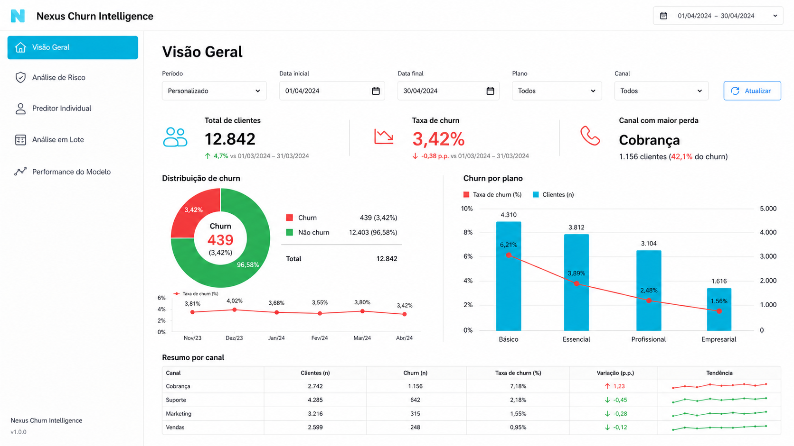

<div align="center">

  

  <h1>Nexus Churn Intelligence</h1>
  <p><strong>Previsão de cancelamento de clientes (churn) para SaaS — do dado sintético ao dashboard interativo</strong></p>

  [](https://www.python.org/)
  [](https://streamlit.io/)
  [](https://scikit-learn.org/)
  [](https://jupyter.org/)
  []()

</div>

---

## Sobre o projeto

**Nexus Churn Intelligence** é um projeto de portfólio completo em Python que modela o risco de cancelamento de clientes de uma empresa fictícia de SaaS brasileira — a **Nexus**. O pipeline cobre todas as etapas de um projeto real de ciência de dados:

- Geração de base sintética realista com padrões de comportamento distintos entre clientes ativos e em churn
- Análise Exploratória de Dados (EDA) com gráficos publicados em `assets/`
- Pré-processamento, balanceamento com **SMOTE** e comparação de modelos
- Deploy de dashboard interativo em **Streamlit** com 5 módulos funcionais

---

## Funcionalidades do dashboard

| Módulo | Descrição |
|---|---|
| **Visão Geral** | KPIs da base, distribuição de churn e taxas por plano e canal |
| **Análise de Risco** | Segmentação de risco por plano, canal, região e boxplots comparativos |
| **Preditor Individual** | Formulário interativo para calcular o risco de um cliente específico em tempo real |
| **Análise em Lote** | Upload de CSV para classificar múltiplos clientes com download do resultado |
| **Performance do Modelo** | Métricas, matriz de confusão, curva ROC e feature importance do modelo salvo |

### Classificação de risco

O modelo retorna uma probabilidade contínua e classifica cada cliente em um dos três níveis acionáveis:

| Nível | Faixa | Recomendação |
|---|---|---|
| 🔴 **Alto** | > 70% | Acionar gerente de conta imediatamente |
| 🟡 **Médio** | 40% – 70% | Enviar campanha de retenção |
| 🟢 **Baixo** | < 40% | Monitorar no próximo ciclo |

---

## Dataset sintético

A base contém **3.000 clientes** gerados com `seed=42` e taxa de churn de **25%** (750 cancelamentos). As distribuições das variáveis refletem padrões realistas — clientes em churn têm NPS menor, mais tickets abertos e menor uso médio.

| Feature | Tipo | Descrição |
|---|---|---|
| `plano` | Categórica | Starter / Pro / Enterprise |
| `tempo_como_cliente_meses` | Numérica | Antiguidade em meses (1–72) |
| `numero_produtos` | Numérica | Quantidade de produtos contratados |
| `tickets_abertos_ultimo_mes` | Numérica | Chamados abertos no último mês |
| `tickets_resolvidos` | Numérica | Chamados resolvidos no mesmo período |
| `nps_score` | Numérica | Net Promoter Score (0–100) |
| `uso_medio_mensal_horas` | Numérica | Horas de uso médio por mês |
| `atraso_pagamento_dias` | Numérica | Dias de atraso no último pagamento |
| `desconto_recebido` | Binária | Recebeu desconto? (0/1) |
| `canal_aquisicao` | Categórica | Indicação / Google Ads / LinkedIn / Evento / Inbound |
| `regiao` | Categórica | Norte / Nordeste / Centro-Oeste / Sudeste / Sul |

---

## Resultados dos modelos

Três modelos foram treinados com `train/test split 80/20 estratificado` e SMOTE no conjunto de treino para equalizar as classes.

| Modelo | Accuracy | Precision | Recall | F1 | ROC-AUC |
|---|---|---|---|---|---|
| **Logistic Regression** | **0.9967** | **0.9933** | **0.9933** | **0.9933** | **0.99997** |
| Gradient Boosting | 0.9900 | 0.9800 | 0.9800 | 0.9800 | 0.99966 |
| Random Forest | 0.9883 | 0.9864 | 0.9667 | 0.9764 | 0.99970 |

> O modelo salvo e usado no dashboard é a **Regressão Logística**, que atingiu F1 = 0.993 e ROC-AUC ≈ 1.000 no conjunto de teste.

---

## Stack tecnológica

| Camada | Bibliotecas |
|---|---|
| Manipulação de dados | `pandas`, `numpy` |
| Visualização | `matplotlib`, `seaborn` |
| Machine Learning | `scikit-learn`, `imbalanced-learn` |
| Interface web | `streamlit` |
| Persistência de modelos | `joblib` |
| Notebooks | `jupyter`, `nbconvert`, `ipykernel` |

---

## Estrutura do projeto

```
customer-churn-prediction-python-ai/
├── app.py                          # Dashboard Streamlit (5 páginas)
├── gerar_base.py                   # Gerador da base sintética
├── requirements.txt                # Dependências
│
├── data/
│   └── clientes_churn_ficticio.csv # Base com 3.000 clientes
│
├── notebooks/
│   └── churn_analysis_model.ipynb  # EDA, pré-processamento, treino e avaliação
│
├── models/
│   ├── churn_model.pkl             # Modelo salvo (Logistic Regression)
│   └── churn_preprocessor.pkl      # Pipeline de pré-processamento
│
├── outputs/
│   ├── model_artifacts.joblib      # Métricas, curva ROC, feature importance
│   └── comparativo_modelos.csv     # Tabela comparativa dos modelos
│
└── assets/                         # Gráficos gerados pelo notebook
    ├── dashboard_concept.png
    ├── distribuicao_churn.png
    ├── churn_por_plano.png
    ├── churn_por_canal.png
    ├── churn_por_regiao.png
    ├── boxplot_nps_churn.png
    ├── boxplot_uso_churn.png
    ├── boxplot_tickets_churn.png
    └── correlacao_variaveis_numericas.png
```

---

## Como executar localmente

### Pré-requisitos

- Python 3.9+
- `pip`

### Passo a passo

```bash
# 1. Clone o repositório
git clone https://github.com/Vitt2909/customer-churn-prediction-python-ai-1.git
cd customer-churn-prediction-python-ai-1

# 2. Instale as dependências
pip install -r requirements.txt

# 3. Gere a base sintética
python gerar_base.py

# 4. Execute o notebook (treina e salva o modelo)
jupyter nbconvert --to notebook --execute --inplace notebooks/churn_analysis_model.ipynb

# 5. Inicie o dashboard
streamlit run app.py
```

> Os passos 3 e 4 já foram executados — os artefatos estão commitados no repositório. Você pode pular direto para o passo 5.

---

<div align="center">
  Feito com dedicação para a comunidade de dados brasileira.
</div>
